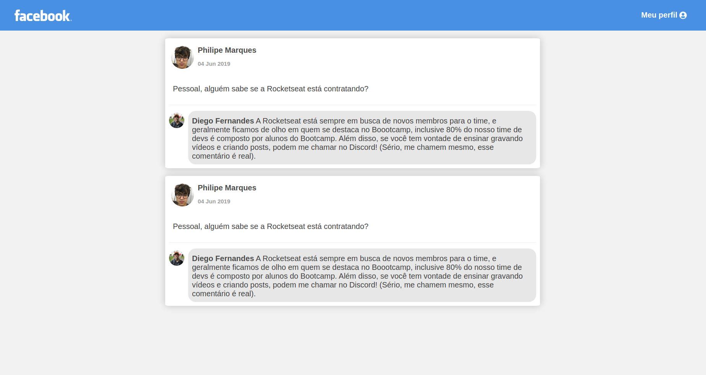

<h1 align="center">
    
</h1>

## :book: Sobre:
O Repositório foi criado com o intuito de realizar o desafio 04 do curso GoStack da RocketSeat. 
Link para especificação: https://github.com/Rocketseat/bootcamp-gostack-desafio-04

## :gear: Tecnologias:
- [ReactJS](https://pt-br.reactjs.org/docs/getting-started.html)
- [Styled Components](https://styled-components.com/docs/basics)
- [React-icons](https://react-icons.netlify.com/#/)

## :bulb: Aprendizado:
Nesse projeto aprendi a utilizar a estrutura do ReactJS e styled-components para criar componentes de forma eficiente e funcional

## :fire: Resultado:

Feito com ❤️ por Philipe Marques 👋🏻 [Get in touch!](https://github.com/xRiku)
